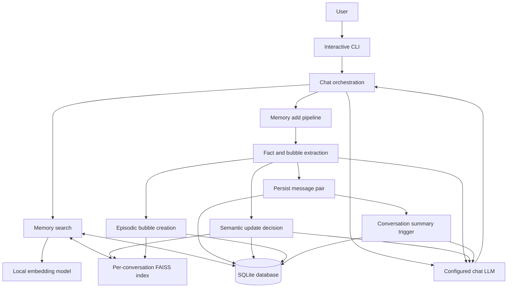
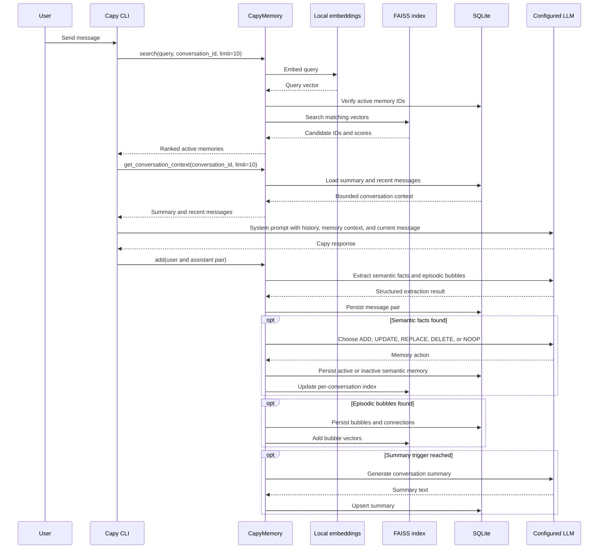
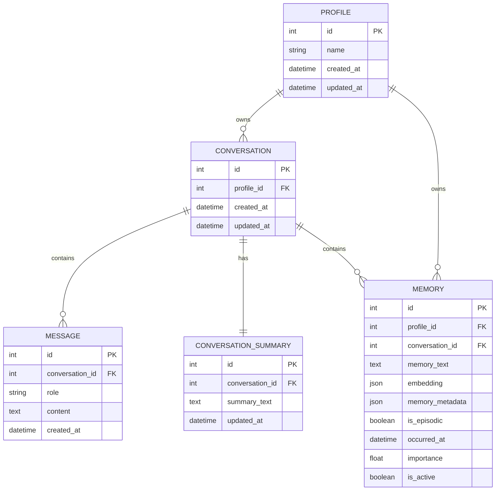

# Capy Memory - High-Level Design

## 1. Purpose

Capy Memory is a Python CLI companion that preserves useful conversational context without storing every sentence as a permanent fact. It combines an OpenAI-compatible language model with local embeddings, SQLite persistence, and FAISS retrieval.

The central principle is simple: **store what the user explicitly says, retrieve only what is relevant, and let newer information replace outdated information.**

Capy is currently a single-process reference application. Its design favors readability and a visible memory lifecycle over a large framework or hosted service surface.

## 2. Goals and non-goals

| Goals | Non-goals |
| --- | --- |
| Preserve useful semantic facts and meaningful short-term events. | Store every message as a long-term fact. |
| Update or deactivate outdated preferences and profile details. | Infer user attributes that were never explicitly supplied. |
| Retrieve relevant context with local vector search. | Provide cross-profile or cross-conversation retrieval by default. |
| Keep messages, summaries, and memories durable in local storage. | Provide multi-user authentication or cloud tenancy. |
| Make memory behavior testable with offline and live suites. | Serve as a production-ready secret vault or compliance system. |

## 3. Architecture overview



The diagram is intentionally centered on the boundary between durable local state and provider-backed language tasks. Embeddings are local by default; the chat, extraction, update-classification, and summary operations use the configured LLM provider.

## 4. Components and responsibilities

| Component | Location | Responsibility |
| --- | --- | --- |
| Interactive entry point | `main.py` | Creates tables, finds or creates the demo profile, resumes or creates a conversation, and runs the input loop. |
| Settings | `src/capy/core/settings.py` | Loads environment or programmatic configuration and provides provider/database defaults. |
| LLM and embedding clients | `src/capy/core/openai.py`, `src/capy/memory/embeddings.py` | Lazily creates OpenAI-compatible chat clients and local or optional remote embedding clients. |
| Database layer | `src/capy/db/` | Manages the SQLAlchemy engine, sessions, table creation, and persistent model definitions. |
| Memory facade | `src/capy/memory/memory.py` | Coordinates extraction, update handling, bubble creation, search ranking, direct updates, and soft deletion. |
| Extraction phase | `src/capy/memory/add/add_extraction_phase.py` | Supplies the latest pair plus context to the extraction model, persists messages, and triggers summaries. |
| Semantic updater | `src/capy/memory/add/add_updation_phase.py` | Embeds candidate facts, finds similar memories, applies an LLM-selected update action, and persists the index. |
| Episodic bubbles | `src/capy/memory/bubble_creator.py` | Stores significant, time-bound events with an importance score and related-memory connections. |
| Vector store | `src/capy/memory/vector_store.py` | Maintains one persisted FAISS index and ID map per conversation. |
| Summary generator | `src/capy/utils/summary_generator.py` | Creates or replaces a conversation summary at a configured message-count trigger. |
| Prompts | `src/capy/prompts/` | Defines the structured extraction, memory-action, and summary instructions. |
| Test suite | `tests/` | Verifies configuration, storage, embeddings, memory lifecycle, summaries, main flow, and optional live services. |

## 5. Primary chat workflow



The response-generation path uses the current message, up to ten retrieved memories, a bounded recent-message window, and the stored conversation summary when one exists. This gives Capy short-term conversational continuity without sending an unbounded transcript. Prior assistant messages are treated as dialogue context rather than proof of a user fact.

## 6. Data model



### Memory records

A `Memory` record is either semantic or episodic:

- **Semantic memory** represents a long-lived user fact, such as a preference, role, skill, or location.
- **Episodic bubble** represents a significant time-bound moment, such as a deadline, decision, or active blocker.

Both forms retain `profile_id` and `conversation_id`, searchable embedding data, timestamps, and `is_active`. Soft deletion deactivates a record rather than erasing the database row.

`memory_metadata` stores connection information for related episodic bubbles. `importance` influences retrieval; bubbles also receive a time-based recency adjustment.

## 7. Memory lifecycle

### 7.1 Extraction

For each user/assistant pair, Capy asks the extraction model for structured JSON with two arrays:

```json
{
  "semantic": ["User prefers dark mode"],
  "bubbles": [
    {
      "text": "User is preparing for a production deployment tomorrow",
      "importance": 0.8
    }
  ]
}
```

The extraction prompt directs the model to use explicit user statements from the latest interaction. Existing messages and a prior summary are context to help interpret that latest turn, not sources for newly invented facts.

### 7.2 Semantic update actions

For every semantic candidate, Capy finds similar active memories in the same conversation and asks the memory-management model to select an action:

| Action | Database and index effect |
| --- | --- |
| `ADD` | Creates a new active memory and indexes it. |
| `UPDATE` | Rewrites an existing memory and replaces its vector mapping. |
| `REPLACE` | Marks the contradictory record inactive, then stores and indexes the new fact. |
| `DELETE` | Marks the selected record inactive and removes its active FAISS mapping. |
| `NOOP` | Leaves the current state unchanged. |

This makes changes such as “I no longer like tea; I prefer coffee” representable without retaining the old preference as active context. Exact semantic restatements are skipped, classifier targets are checked against the current conversation, and classifier-normalized text is embedded using the exact text that is stored.

### 7.3 Episodic bubbles

Bubbles are created with `is_episodic=True`, a current UTC `occurred_at` timestamp, and a model-provided importance score. After indexing a new bubble, Capy can connect it to related memories through metadata links. A very similar active bubble from the recent seven-day window is consolidated into the existing record, keeping the more descriptive wording and refreshing its recency/importance instead of creating an immediate duplicate.

### 7.4 Conversation summaries

After a message pair is persisted, Capy checks the conversation message count. At every 20 messages, it asks the LLM to create or replace the summary stored for that conversation. The current implementation summarizes up to 200 messages in chronological order.

## 8. Search and ranking

Capy searches the current conversation only.

1. Embed the user query.
2. Load the conversation's persisted FAISS index.
3. Compare the index ID map with active SQLite memory IDs; rebuild from SQLite if the sets differ.
4. Retrieve candidate vectors with FAISS.
5. Filter to active records and rank results.

The final score is:

```text
FAISS similarity × memory importance × recency
```

Semantic records have a recency multiplier of `1.0`. Episodic bubbles decay using an exponential function based on days since `occurred_at`.

FAISS uses `IndexFlatIP`. Capy normalizes vectors before indexing and querying, so inner-product scores behave as cosine similarity. This is an exact flat search index, not an approximate or logarithmic index.

## 9. Configuration and provider boundary

### Default configuration

| Concern | Default |
| --- | --- |
| Chat provider | `general_compute` |
| Chat endpoint | `https://api.generalcompute.com/v1` |
| Chat model | `gpt-oss-120b` |
| Embedding provider | `local` |
| Embedding model | `sentence-transformers/all-MiniLM-L6-v2` |
| Database | `data/capy_memory.db` when `DATABASE_URL` is unset |

Capy also supports OpenRouter as an OpenAI-compatible chat provider and, optionally, as an embedding provider. Provider clients are created lazily and cached for the current process.

### Boundary rules

- `GENERAL_COMPUTE_API_KEY` and optional `OPENROUTER_API_KEY` belong in environment configuration, never in source files or prompts.
- Local embeddings keep ordinary retrieval vectors on the machine by default.
- The configured LLM receives content necessary for chat, extraction, semantic classification, or summary generation. Treat conversation content and memories as data shared with that provider.
- SQLite and FAISS artifacts are local application data and are ignored by Git under `data/`.

## 10. Persistence and recovery

Capy keeps two persistence layers:

```text
SQLite
├── profiles, conversations, messages, summaries, and memory rows
└── active/inactive memory state and JSON embeddings

FAISS
└── data/capy_memory/indexes/conv_<conversation_id>.*
```

SQLite is the source of truth for active memory records. The FAISS index accelerates lookup. On search, Capy compares active database memory IDs with the FAISS ID map and rebuilds an incomplete or stale index from the database when they differ.

The database location can be overridden with `DATABASE_URL`; an explicit SQLite path creates its parent directory automatically. The FAISS index directory is currently derived from the process working directory.

## 11. Reliability and testing

`create_table()` imports every model module before running SQLAlchemy's `create_all()`, making startup idempotent for the supported schema.

The test suite is separated into safe and credit-consuming layers:

| Test layer | Command | Coverage |
| --- | --- | --- |
| Offline | `uv run pytest tests -v -m "not live"` | Settings, schema registration, local embeddings, memory lifecycle, bubble consolidation, index rebuilding, summaries, bounded chat context, and main flow. |
| Live | `CAPY_RUN_LIVE_E2E=1 uv run pytest tests -v` | General Compute requests, the configured model, local embeddings, and end-to-end chat-to-memory persistence. |
| Contract evaluation | `uv run python evals/run_evals.py` | Six deterministic scenarios, including recall, replacement, unknown details, secret refusal, recency, and an exact 51-turn fixture. |

Live tests are opt-in because they require a real `GENERAL_COMPUTE_API_KEY` and consume provider credits. The contract evaluation is offline and must not be presented as a live LLM quality score.

## 12. Security and privacy considerations

- Local SQLite and FAISS artifacts may contain personal preferences, conversation text, summaries, and embedding data. Keep `data/` private and out of version control.
- `.env` files must remain local. Never paste API keys, passwords, tokens, or credentials into a conversation.
- The current project has no authentication, authorization, encryption at rest, rate limiting, or audit trail. It should remain a trusted local application until those controls are added.
- Soft-deleted records are retained in SQLite for lifecycle history. A stronger retention or erasure policy is needed for sensitive production data.
- Set `DEBUG=false` outside local troubleshooting because debug output can expose operational details and memory excerpts.

## 13. Current scope and extension path

Capy intentionally keeps the first version focused. The remaining high-value improvements are:

1. Add a profile-wide retrieval policy when cross-conversation memory is explicitly desired.
2. Make the `memories` command a complete active-record view rather than a semantic lookup.
3. Add stronger semantic canonicalization for paraphrases while preserving legitimate independent events.
4. Add a live, cost-labelled long-horizon model evaluation rather than relying only on deterministic contract fixtures.
5. Add database migrations, index compaction, backups, and retention controls.
6. Add authentication, authorization, encryption, and observability before any shared deployment.

## 14. Design decisions

| Decision | Rationale |
| --- | --- |
| Local embeddings by default | Keeps ordinary retrieval inexpensive and avoids sending every query to an embedding API. |
| SQLite as source of truth | Provides a simple, inspectable persistent record for a CLI application. |
| Separate FAISS index per conversation | Keeps retrieval isolated and makes index files easy to inspect or rebuild. |
| Semantic facts and episodic bubbles | Lets durable profile context coexist with time-sensitive reminders and blockers. |
| Soft deletion for replacements | Prevents outdated memories from being retrieved while preserving lifecycle history. |
| LLM-directed update actions | Handles natural-language contradictions and refinements without hard-coded domain rules. |
| Conservative recent-bubble consolidation | Prevents repeated versions of one immediate event from overwhelming retrieval while preserving older, separate events. |
| Bounded recent chat context | Improves continuity without putting an unbounded transcript into every provider request. |
| ID-set index validation | Protects retrieval when persisted FAISS mappings drift from active SQLite records. |
| Opt-in live tests and offline contract evaluation | Separates repeatable policy evidence from credit-consuming model behavior. |
